# Forecasting TRM (USD/COP) — Análisis de Series de Tiempo con Python

> **Proyecto de portafolio** | Ciencia de Datos | Series de Tiempo | Econometría aplicada

---

## Metodología

Este proyecto aplica un enfoque de forecasting por fases, siguiendo la estructura del libro *Forecasting: Principles and Practice, the Pythonic Way* (Hyndman et al., 2025). Cada fase construye sobre la anterior con una hipótesis explícita que se confirma o refuta con datos reales.

### Fase 1 — Análisis exploratorio (EDA)

- Descarga de datos reales vía Yahoo Finance (`COP=X`), 2016–2026
- Detección y filtrado de outliers en retornos diarios (cambios >15% diario = error de fuente)
- Descomposición STL para separar tendencia, estacionalidad y residuos
- **Hallazgo clave:** la estacionalidad mensual de la TRM es prácticamente inexistente (~$200 COP de diferencia entre meses). La varianza está dominada por tendencia y residuos. Los residuos muestran heterocedasticidad creciente desde 2020.

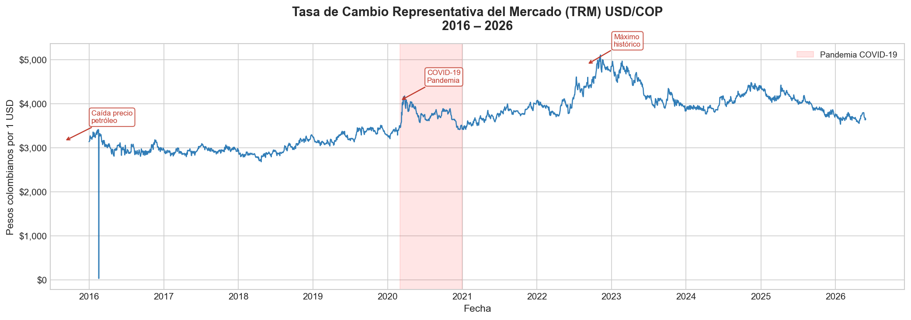
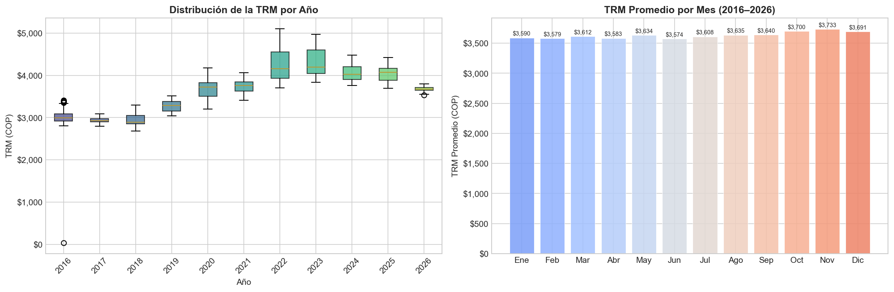
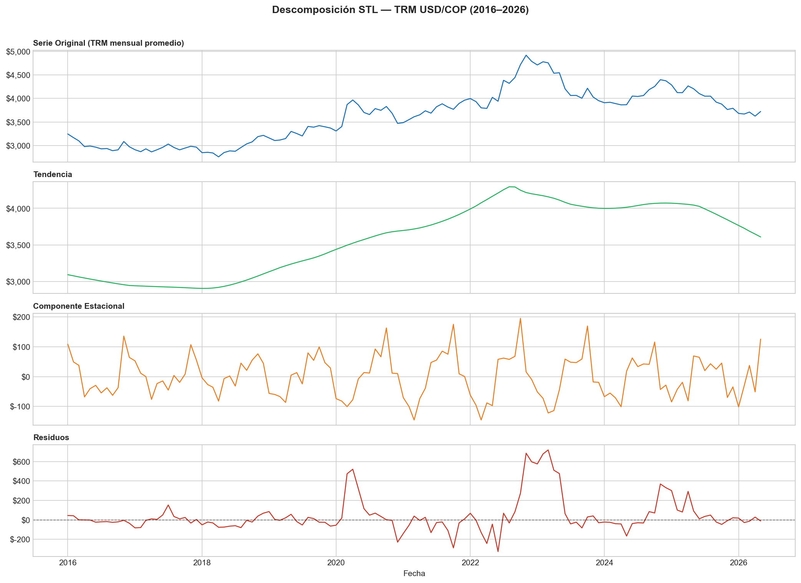
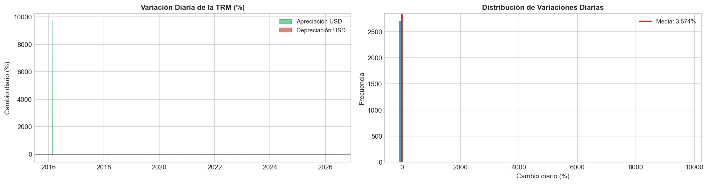

---

### Fase 2 — Modelos base (benchmark)

- **División train/test:** entrenamiento 2016–2024, evaluación 2025–2026 (datos ya ocurridos)
- Modelos evaluados: **Naive**, **Drift**, **ETS (AutoETS)**
- **Hallazgo clave:** Naive y AutoETS convergieron a métricas idénticas (MAE: $435 COP, MAPE: 11.39%). AutoETS con alpha ≈ 1 es matemáticamente equivalente al Naive, lo que constituye evidencia inicial de que la TRM sigue un random walk.

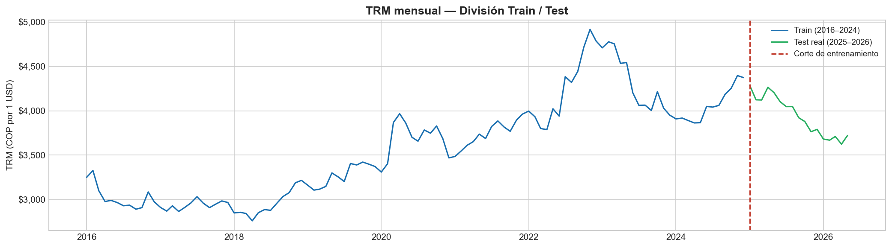
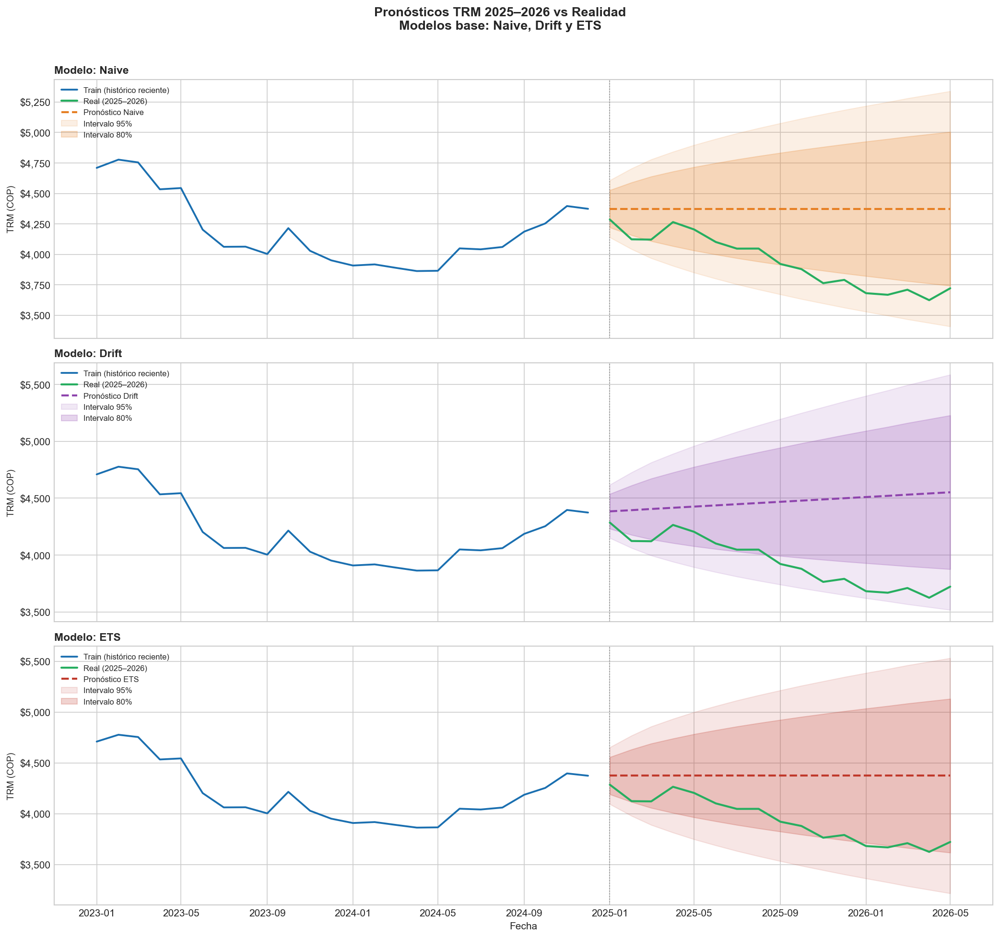
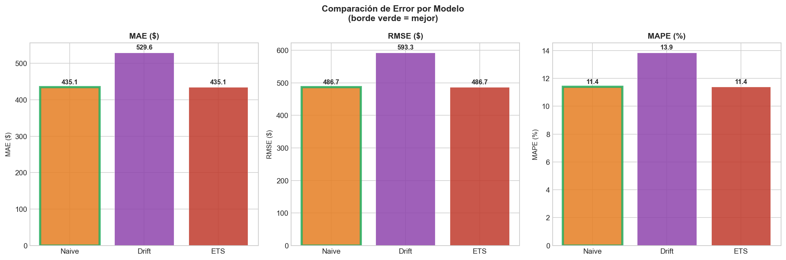
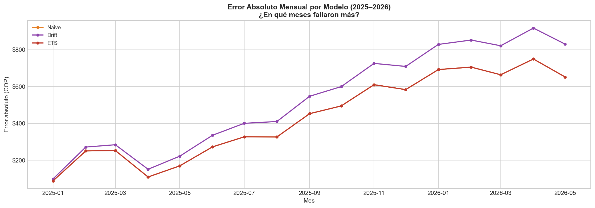

---

### Fase 3 — AutoARIMA

- Análisis de ACF y PACF pre-modelado para proponer (p,d,q) antes de correr el algoritmo
- **Hipótesis previa:** ARIMA(0,1,0) — basada en los hallazgos de la Fase 2
- AutoARIMA evaluó exhaustivamente el espacio de modelos ARIMA posibles
- **Hipótesis confirmada:** AutoARIMA seleccionó ARIMA(0,1,0), idéntico al Naive
- Test de Ljung-Box sobre residuos: p-valor = 0.52 → residuos sin autocorrelación → el modelo capturó toda la estructura disponible en la serie

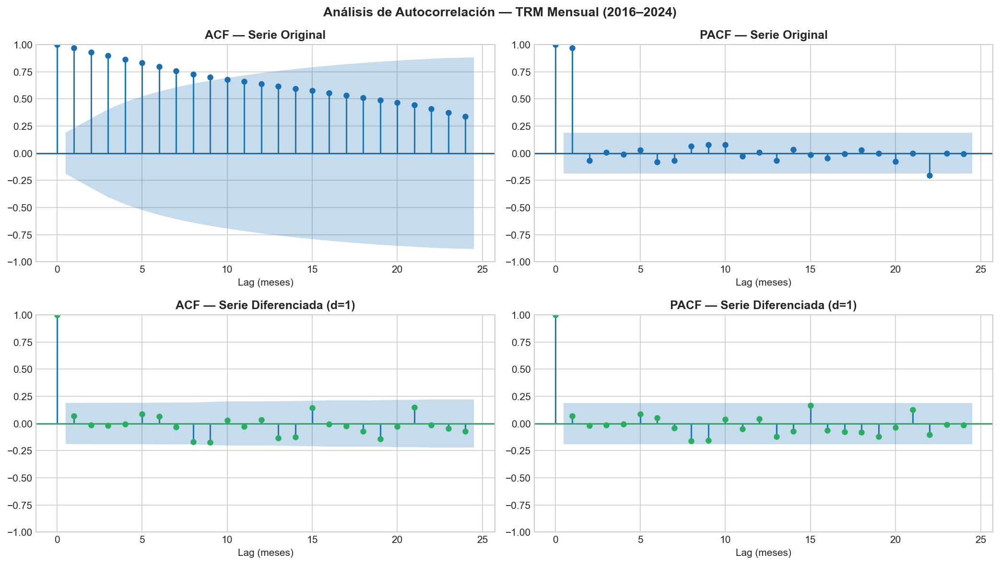
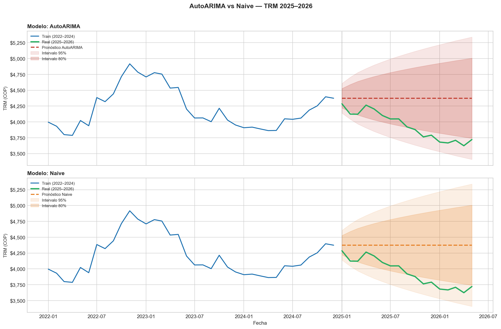
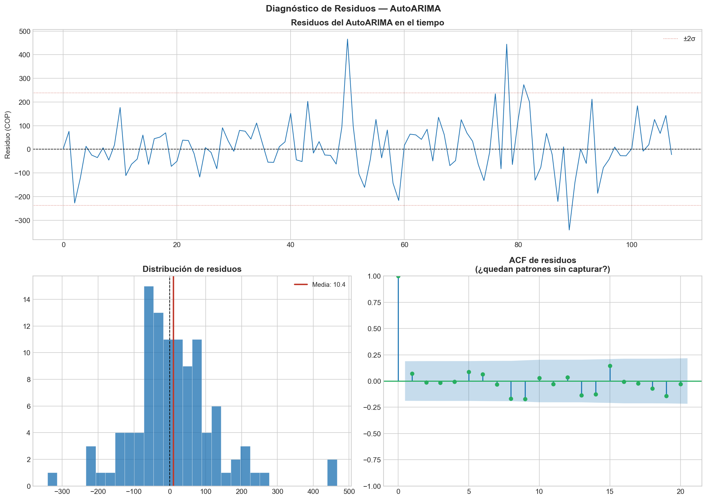

---

## Resultados

| Modelo | MAE (COP) | RMSE (COP) | MAPE (%) | Sesgo (COP) |
|--------|-----------|------------|----------|-------------|
| **Naive** ⭐ | 435 | 487 | 11.39 | -435 |
| ETS | 435 | 487 | 11.39 | -435 |
| AutoARIMA | 435 | 487 | 11.39 | -435 |
| Drift | 530 | 593 | 13.86 | -530 |

> ⭐ **Modelo seleccionado por parsimonia:** ante empate en todas las métricas, se aplica el principio de parsimonia — el modelo más simple con igual desempeño es preferible.

**Nota sobre el sesgo:** todos los modelos muestran sesgo negativo (~-$435 COP), lo que indica que sobreestimaron la TRM real de 2025–2026. En términos prácticos, una empresa importadora que usara estos modelos habría comprado coberturas cambiarias a un precio mayor al necesario.

---

## Conclusión principal

> **La TRM colombiana se comporta como un random walk.**

Confirmado por tres métodos independientes:

1. **Visual:** ACF de la serie original decae lentamente; ACF de la serie diferenciada (d=1) es ruido blanco
2. **Benchmark:** AutoETS con alpha ≈ 1 converge al Naive
3. **Estadístico:** AutoARIMA selecciona ARIMA(0,1,0); test de Ljung-Box confirma residuos sin autocorrelación

La implicación directa es que **ningún modelo que use exclusivamente el historial de la TRM puede superar consistentemente al Naive**, porque los precios pasados no contienen información predictiva sobre los precios futuros más allá del último valor observado. Esto es consistente con la hipótesis de eficiencia de mercado débil aplicada al mercado cambiario colombiano.

---

## Limitaciones y próximos pasos

El resultado anterior **no implica que la TRM sea impredecible en absoluto** — implica que su historial propio no es suficiente. Las extensiones naturales son:

- **ARIMAX / regresión con errores ARIMA:** incorporar variables exógenas como precio del petróleo (Brent), tasas de la Reserva Federal, índice EMBI Colombia, inflación diferencial
- **Modelos GARCH:** la heterocedasticidad creciente en los residuos sugiere que la *volatilidad* de la TRM sí tiene estructura modelable, aunque el nivel no la tenga
- **Modelos de ML con features macroeconómicas:** XGBoost o LightGBM con variables de política monetaria como predictores

---

## Stack tecnológico

```
Python 3.10+
├── yfinance         — descarga de datos TRM en tiempo real
├── statsforecast    — Naive, AutoETS, AutoARIMA (Nixtlaverse)
├── statsmodels      — descomposición STL, ACF/PACF, test Ljung-Box, test ADF
├── pandas           — manipulación de series temporales
└── matplotlib       — visualización
```

---

## Estructura del repositorio

```
forecasting-trm/
├── forecasting_trm_fase1.ipynb   # EDA, STL, volatilidad
├── forecasting_trm_fase2.ipynb   # Naive, Drift, ETS
├── forecasting_trm_fase3.ipynb   # AutoARIMA, diagnóstico de residuos
├── README.md
├── requirements.txt
└── outputs/
    ├── 01_serie_trm.png
    ├── 02_distribucion_trm.png
    ├── 03_descomposicion_stl.png
    ├── 04_retornos_trm.png
    ├── 05_train_test_split.png
    ├── 06_pronosticos_modelos_base.png
    ├── 07_comparacion_errores.png
    ├── 08_error_mensual.png
    ├── 09_acf_pacf.png
    ├── 10_autoarima_vs_naive.png
    └── 11_diagnostico_residuos.png
```

---

## Referencia

Hyndman, R.J., Athanasopoulos, G. et al. (2025). *Forecasting: Principles and Practice, the Pythonic Way*. OTexts. [https://otexts.com/fpppy](https://otexts.com/fpppy)

---

*Proyecto desarrollado como parte de un portafolio de ciencia de datos aplicada a economía colombiana.*
